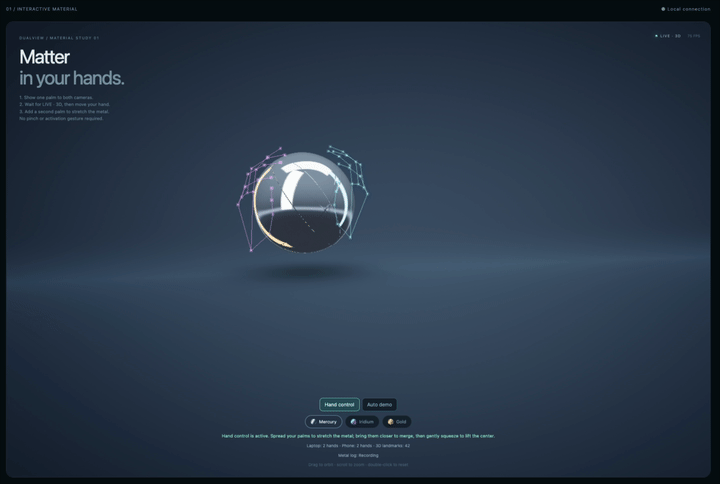
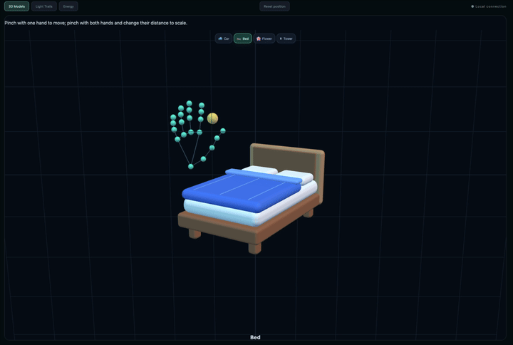
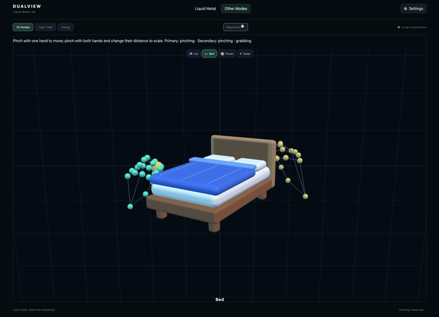
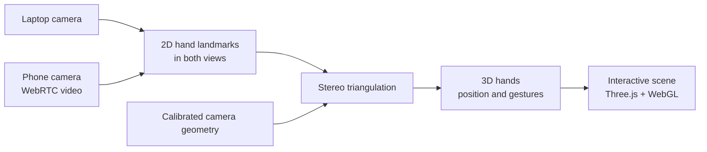
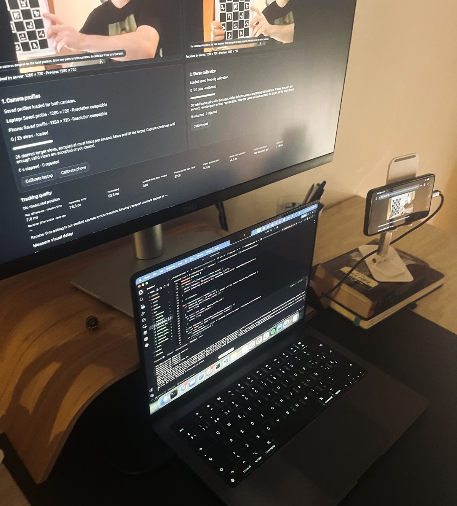

# DualView — See Your Hands in 3D, With Two Ordinary Cameras

**A laptop and a phone. No depth sensor. Your hands reconstructed in 3D and used to move real objects in a virtual scene.**

Point a laptop camera and a phone camera at the same pair of hands. DualView finds 21 landmarks per hand in *both* views, then uses calibrated stereo geometry to **triangulate every landmark into 3D space, in metres**. Pinch to pick up a 3D model and move it through depth. Pinch with both hands to scale it. Spread your palms to stretch a liquid-metal sculpture and squeeze to lift its centre.

Two everyday devices, working as a stereo rig. The phone streams video from its browser over WebRTC; a local C++ backend runs hand inference and 3D reconstruction; a React and Three.js frontend renders the result. **Everything runs on your own machine** — no cloud inference, no depth camera, no headset.

[The 3D problem](#how-two-cameras-become-3d) · [What you can do](#what-you-can-do) · [Camera setup](#camera-setup) · [Quick start](#quick-start-on-macos-apple-silicon) · [Architecture](docs/architecture.md) · [Evaluation and limits](docs/evaluation.md)

## What you can do

### Shape liquid metal

Spread your palms to stretch the material, bring them together to merge it, then squeeze to lift its centre. A procedural interactive material with an approximate volume budget.



*Both hand skeletons are drawn from the triangulated 3D landmarks — the cyan and magenta joints are the reconstruction, not a 2D overlay.*

### Move and scale 3D objects

**Move:** pinch your thumb and index finger, then move your hand to reposition the model — including toward and away from you, because the reconstruction is genuinely three-dimensional.



**Scale:** pinch with both hands and change the distance between them to resize the model.



*The scale factor comes from the metric distance between the two pinch points in 3D, so it is unaffected by how far the hands are from either camera.*

Models are original procedural geometry: a bed, car, flower and tower, plus Light Trails and Energy experiments. **Auto demo** explores the liquid material without cameras; live 3D hand control requires calibration.

## How two cameras become 3D

A single camera cannot measure depth — a small hand nearby and a large hand far away produce the same image. Two cameras can, if you know exactly how they relate to each other. That "if" is the entire engineering problem, and it is what this project implements.



Each camera sees 21 landmarks per hand. For one landmark, each camera defines a ray through space; where the two rays meet is the landmark's 3D position. Doing that reliably with a phone on a stand and a laptop lid requires solving several problems that are easy to get quietly wrong:

| Problem | What this project does |
| --- | --- |
| **Where are the cameras?** | ChArUco-target calibration solves each camera's intrinsics and lens distortion, then composes both target poses into the phone-from-laptop rigid transform (`calibration.cpp`). |
| **Lens distortion bends the rays** | Landmarks are undistorted into normalized camera coordinates before any triangulation, so rays are straight lines in a metric frame. |
| **Which hand is which?** | Both cross-view assignments are enumerated and the one with the lowest total reprojection error wins; hand identity is then preserved frame to frame so a held object never jumps to the other palm. |
| **Is the 3D point real?** | Every landmark is re-projected into both images and rejected above a pixel threshold, with depth-plausibility bounds in both camera frames. |
| **The cameras don't fire together** | Frames are paired by receive time against the slower stream, with an explicit age budget. This is approximate pairing, and [the evaluation quantifies exactly what it costs](docs/evaluation.md). |
| **The phone changes resolution** | Intrinsics are rescaled only after verifying the new stream is a *uniform* resize of the calibrated profile — a crop or aspect change is rejected rather than silently producing wrong geometry. |
| **Model preprocessing must match** | The palm detector's oriented-crop preprocessing is reimplemented to match the upstream MediaPipe pipeline and pinned by a golden fixture test, because silent preprocessing drift degrades accuracy invisibly. |
| **Hands briefly disappear** | Short gaps are covered by filtering and bounded velocity prediction, labelled `predicted` in telemetry and expired after 500 ms so a guess is never mistaken for a measurement. |

OpenCV supplies the primitives (`calibrateCamera`, `triangulatePoints`, ChArUco detection); the reconstruction pipeline, cross-view matching, validation gating, identity tracking and timing policy built on top of them are this project's own.

| Layer | Technology |
| --- | --- |
| Hand inference | ONNX Runtime, OpenCV Zoo palm and hand-pose models; CPU or macOS Core ML |
| Calibration and 3D geometry | OpenCV, ChArUco, stereo triangulation |
| Local server and transport | C++20, GStreamer, libsoup, HTTPS, WebRTC |
| Interface and rendering | React, TypeScript, Three.js, custom GLSL material |

Video travels over WebRTC; telemetry and commands use its DataChannel. WebSocket handles connection signaling. See the [full architecture](docs/architecture.md), [wire protocol](docs/protocol.md), and [inference pipeline](docs/inference.md).

## Engineering evidence

Stereo reconstruction is easy to *appear* to get right, so the geometry is measured rather than asserted:

- **[Synthetic geometry evaluation](docs/evaluation.md)** — reproducible noise, baseline, depth, timing and calibration-error experiments with [raw results](docs/evaluation/synthetic-geometry.json). The headline finding: a 40 ms hidden exposure delay yields about **67 mm of 3D error while reprojection residual stays near zero**. Low reprojection error is a consistency check, not proof of accuracy. Run it yourself with `make evaluate`.
- **[Runtime ownership contract](docs/runtime-ownership.md)** — state owners, lock ordering, cancellation, persistence and publication guarantees for the concurrent pipeline.
- **[Backpressure and operating limits](docs/operating-limits.md)** — the policy at every queueing boundary, and the conditions the system is designed for.
- **[Verification](docs/verification.md)** — native and browser tests, concurrency tests, sanitizer coverage and outstanding physical-device measurements.

Physical hand accuracy and end-to-end latency have **not** been established. The synthetic results verify geometry behaviour; they do not substitute for a measured real-camera demo.

## Camera setup

A laptop with a camera, a phone on a stable stand, and a shared local network. Both cameras must see the same hands from different positions — that difference in viewpoint is what produces depth. The phone supplies the second viewpoint; the computer does the processing.



*Stereo calibration in progress. The phone on the stand is the second camera; the laptop runs the backend. The dashboard shows both camera previews with the printed ChArUco target visible in each, alongside the per-camera intrinsic profiles, the stereo pair counter, and live tracking-quality readouts.*

1. Place the phone beside the laptop and aim both cameras at a shared hand workspace.
2. Connect the phone through the pairing link and select its camera and resolution.
3. Calibrate each camera, then calibrate the pair with the printed [ChArUco target](docs/targets/dualview-charuco-a4.pdf).
4. Keep the phone, laptop lid, and camera modes fixed after calibration — moving either camera invalidates the geometry.

Use even lighting and keep the entire hand visible in both previews. See [calibration](docs/calibration.md), [phone HTTPS setup](docs/https-android.md), and [video quality](docs/video-quality.md).

## Quick start on macOS Apple Silicon

Prerequisites: Xcode Command Line Tools and Node.js 24+.

```bash
brew install cmake pkg-config opencv@4 nlohmann-json gstreamer libnice-gstreamer mkcert
cp .env.example .env
make frontend-install
make backend-install
make build
```

The dependency installers download checksum-verified ONNX Runtime 1.30.0 and hand models to ignored local directories. The build itself downloads nothing. macOS Apple Silicon is the verified installation target; other platforms need their own ONNX Runtime installation selected with `DUALVIEW_ONNXRUNTIME_ROOT` in CMake.

Create a development certificate for the LAN hostname or IP your phone will use:

```bash
mkcert -install
mkdir -p certs
mkcert -key-file certs/dualview-lab-key.pem -cert-file certs/dualview-lab.pem localhost 127.0.0.1 my-mac.local 192.168.1.42
```

Set `DUALVIEW_PUBLIC_ORIGIN` in `.env` to that LAN HTTPS origin. Install the local CA certificate on the phone; see [phone HTTPS setup](docs/https-android.md). Then:

```bash
make dev
```

Open the configured HTTPS origin on the laptop, choose **Connect phone**, open the link on your phone, and press **Start camera**. Open **Settings** to calibrate each camera and then the fixed camera pair. See the [calibration guide](docs/calibration.md). Both devices must share a LAN that permits direct connections and WebRTC UDP traffic.

### No second device? Inspect the geometry directly

The stereo mathematics is verifiable without any hardware. After `make configure && make build`:

```bash
make evaluate
```

This projects known 3D points into two synthetic cameras and reports reconstruction error across noise, depth, baseline, timing-delay and calibration-error scenarios. See [evaluation](docs/evaluation.md).

## Configuration

All settings are documented in [.env.example](.env.example). Restart the server after editing `.env`; `make dev` loads it. Running the binary directly uses exported environment variables.

- `DUALVIEW_SHOW_QR_CODE=false` hides the QR image; the pairing link remains available.
- `DUALVIEW_PAIRING_REQUIRED=true` requires a short-lived phone session, independently of QR visibility. A new link invalidates earlier unused links; already-connected peers stay connected.
- `DUALVIEW_INFERENCE_PROVIDER=coreml` selects the Apple provider; `cpu` selects portable ONNX Runtime CPU execution.
- `DUALVIEW_INFERENCE_ALLOW_CPU_FALLBACK=false` fails explicitly when a requested provider is unavailable. Unknown provider names and invalid models always fail.
- `DUALVIEW_INFERENCE_MAX_FPS` bounds inference frequency. The runtime processes one frame pair at a time and retains only the latest frame per camera.

## Verification

```bash
make test
make lint
make format-check      # Requires clang-format: brew install clang-format
make integration-test  # Install Chromium first; see verification guide
```

Use `make format` to apply the shared C++ and frontend formatting rules. Native tests cover configuration validation, frame pairing, calibration geometry, stereo reconstruction, crop preprocessing against a golden fixture, provider selection, concurrency invalidation, and tensor contracts on locally installed hand models. On macOS the model tests exercise both CPU and Core ML. Frontend tests cover spatial projection, stale data, model switching, and effect geometry. The browser smoke test uses synthetic camera video and exercises the C++ WebRTC connection, incoming video, forwarded previews, and navigation; see [verification](docs/verification.md).

## Repository layout

```text
backend/       C++ server, inference providers, geometry, tests, CMake
frontend/      React UI, renderers, WebRTC client, procedural model assets
config/        calibration import schema example
docs/          architecture, setup, calibration, evaluation, verification
scripts/       dependency installers, launch and repository checks
.github/       continuous integration
```

Calibration files, certificates, `.env`, model weights, downloaded runtimes, build outputs, and logs stay local and ignored. See [third-party notices](THIRD_PARTY_NOTICES.md) for model and dependency licensing.

Before committing, stage the intended changes and run `node scripts/check-repository.mjs --staged` to check the exact Git snapshot. `make lint` checks the working tree, including files that are not yet staged. These checks reject Cyrillic text, private keys, common local artifacts, and sources or documents that the snapshot references but does not contain; they are not a general-purpose secret scanner.

## Scope and limits

Use a fixed camera rig and one person with at most two visible hands. Quality depends on calibration, lighting, visibility, and camera timing. Frame pairing uses local receive timestamps; it does **not** establish synchronized camera exposure. Core ML can partition operations across Apple accelerators and CPU, so a provider label is not a claim that every operator ran on the GPU or Neural Engine. Synthetic browser tests do not replace a real phone, real hand tracking, and measured calibration quality.

The full policy at each queueing boundary and the conditions the system is designed for are documented in [Backpressure and operating limits](docs/operating-limits.md).

## Docker

`make docker-up` builds and runs a Linux CPU server with the frontend bundled into the image. For full camera/WebRTC operation, use native Linux and the camera Compose override. On macOS, keep `make dev` for Core ML and the built-in camera. See [Docker setup and limitations](docs/docker.md).

For frame-pair timing, transport metrics and the stationary/moving hand test, see [tracking diagnostics](docs/tracking-diagnostics.md).

## License

MIT — see [LICENSE](LICENSE). Third-party dependencies and model weights keep their own terms; see [THIRD_PARTY_NOTICES.md](THIRD_PARTY_NOTICES.md).
