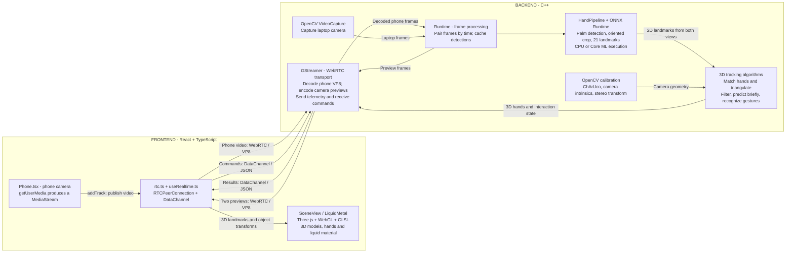

# Architecture

The project has two main parts: a React frontend running in the phone and laptop browsers, and one local C++ backend. The backend computes hand positions; the frontend uses them to animate and render the scene.

For the exact lock and publication contract, see [Runtime ownership](runtime-ownership.md). For reproducible geometry results and their limitations, see [Evaluation](evaluation.md). For the policy at each queueing boundary and the conditions the system is designed for, see [Backpressure and operating limits](operating-limits.md). The diagram below describes the current data flow; its boxes do not all correspond to separate classes or threads.

The frontend transport box represents separate phone and dashboard connections. The phone publishes video; the dashboard receives results and camera previews, sends commands, and renders the scene. Backend boxes are components inside one process.

## Frontend: capture, transmit, render

- **Capture:** `Phone.tsx` calls the browser's `getUserMedia` API to obtain the phone camera's `MediaStream`.
- **Transmit and receive:** `transport/rtc.ts` adds the video track to an `RTCPeerConnection`. On the dashboard, `transport/useRealtime.ts` exposes received telemetry, video streams and a command function to React.
- **Render the mesh and scene:** `SceneView.tsx` uses **Three.js** (`WebGLRenderer`, meshes, buffer geometry and `GLTFLoader`) for 3D models and the hand skeleton. `LiquidMetal.tsx` uses Three.js with a custom **GLSL ShaderMaterial** for the liquid surface. The liquid surface is shader-rendered; the backend does not generate or transmit its mesh.
- **Apply results:** `App.tsx` and `SpatialTracking.tsx` distribute tracking data and camera geometry. Renderers smooth movement and update the scene on browser animation frames. Camera previews appear in video elements with hand overlays.

## Backend: capture, infer, reconstruct

- **Video input:** **OpenCV VideoCapture** reads the laptop camera directly. **GStreamer WebRTC** receives and decodes the phone's VP8 stream into image frames.
- **Scheduling:** `FrameStore` keeps bounded frame histories; `Runtime` selects frames close in receive time and processes one pair at a time. Cached detections avoid repeating inference on a reused frame. This is approximate pairing, not synchronized camera exposure.
- **Inference:** `HandPipeline` runs a palm detector, creates an oriented crop, then runs a hand-pose model producing **21 landmarks per hand**. **ONNX Runtime** executes the models with the selected CPU or macOS Core ML provider. The pipeline maps landmarks back to each camera image.
- **Calibration:** `CalibrationSession` owns explicit capture modes and observations; OpenCV detects the **ChArUco** target and solves camera intrinsics and the relative camera transform. Calibration storage saves compatible YAML separately from the session and supplies geometry to tracking. Expensive calibration and tracking run outside the runtime lock; connection, timing, and session generations guard publication.
- **Additional algorithms:** `HandTracker` matches hands across views, triangulates 2D landmarks into 3D, checks reprojection error, maintains hand identity and filters movement. `InteractionController` derives pinch, move, scale and rotation interactions from typed tracking results. Brief detection gaps allow bounded pose prediction; stale frames or invalid calibration block interaction.

## How results return to the frontend

The backend stores the latest typed result in `Runtime`. Snapshot creation copies consistent domain state under its mutex, then serializes hand/interaction state outside that mutex; JSON is not a second mutable pose model. GStreamer's peer transport reads it and sends a **JSON telemetry message over the WebRTC control DataChannel** approximately every 67 ms. The payload includes 3D hand landmarks in metres, object position/scale/rotation, gesture state, camera matrices and tracking diagnostics. React receives the message through `rtc.ts` and `useRealtime.ts`; Three.js uses those values to update the scene.

Camera previews travel separately as **two VP8 video tracks**, ordered laptop then phone. They do not contain the rendered 3D scene. Commands such as calibration or resetting an object travel in the opposite direction as JSON on the control DataChannel and are validated by `runtime_protocol.cpp` and dispatched as typed commands to `Runtime::execute`.

Connection setup is omitted from the diagram to keep the processing flow clear: **libsoup HTTPS** serves the frontend, configuration and pairing endpoints; **WebSocket `/ws/rtc`** exchanges SDP/ICE to establish WebRTC. Video and telemetry then use the peer connection. All processing stays local.

## Suggested reading order

| Step | Entry points | What to follow |
| --- | --- | --- |
| 1. Startup | [main.cpp](../backend/src/main.cpp), [config.cpp](../backend/src/config.cpp) | Configuration, runtime construction and server lifetime. |
| 2. Frame processing | [runtime.hpp](../backend/include/dualview/runtime.hpp), [runtime.cpp](../backend/src/runtime.cpp), [synchronized_frames.hpp](../backend/include/dualview/synchronized_frames.hpp) | Capture, bounded histories, pair selection, worker and state snapshots. |
| 3. Hand inference | [hand_pipeline.cpp](../backend/src/tracking/hand_pipeline.cpp), [hand_crop.cpp](../backend/src/tracking/hand_crop.cpp), [controller.cpp](../backend/src/inference/controller.cpp), [onnx.cpp](../backend/src/inference/providers/onnx.cpp) | Pixels to 2D landmarks and provider selection. |
| 4. Spatial interaction | [stereo_tracking.cpp](../backend/src/tracking/stereo_tracking.cpp), [interaction.cpp](../backend/src/tracking/interaction.cpp), [calibration_session.cpp](../backend/src/calibration_session.cpp), [calibration.cpp](../backend/src/calibration.cpp) | 2D observations to metric 3D hands, tracking continuity and gestures. |
| 5. Transport | [runtime_protocol.cpp](../backend/src/runtime_protocol.cpp), [server.cpp](../backend/src/transport/server.cpp), [peer.cpp](../backend/src/transport/peer.cpp), [rtc.ts](../frontend/src/transport/rtc.ts) | Pairing, signaling, video forwarding and commands. |
| 6. Rendering | [App.tsx](../frontend/src/App.tsx), [SpatialTracking.tsx](../frontend/src/SpatialTracking.tsx), [SceneView.tsx](../frontend/src/SceneView.tsx), [LiquidMetal.tsx](../frontend/src/LiquidMetal.tsx) | Telemetry to visible movement and material effects. |

For message formats, see [protocol](protocol.md). For geometry setup, see [calibration](calibration.md). For provider contracts, see [inference](inference.md). For timing and tracking failure analysis, see [tracking diagnostics](tracking-diagnostics.md).
